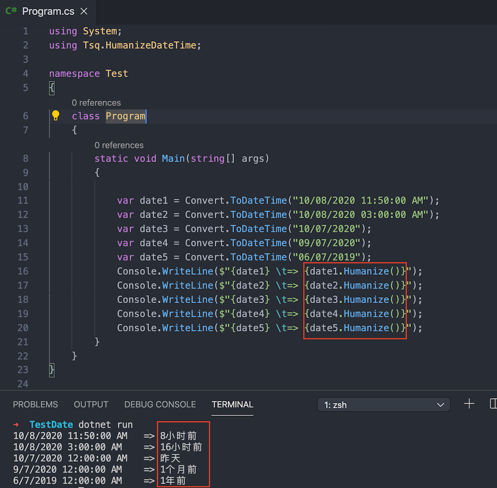

# HumanizeDateTime

将一个Datetime类型的变量转化成易读的中文字符串，例如：10秒前、2分钟前、4小时前、3天前等。

### 用途

常用于前端页面显示易读的日期，如论坛中，帖子的发表日期，评论的回复日期等。

### 安装

```sh
dotnet add package Tsq.HumanizeDateTime
```

也可参考： https://www.nuget.org/packages/Tsq.HumanizeDateTime

### 使用效果



### 使用方法

第一步：引入包

```cs
using Tsq.HumanizeDateTime
```

第二步：Datetime类型的变量直接调用`Humanize()`方法

```cs
dateTime.Humanize(); 
```

一个完整的Demo

```cs
using System;
using Tsq.HumanizeDateTime;

namespace Test
{
    class Program
    {
        static void Main(string[] args)
        {
            
            var date = Convert.ToDateTime("06/07/2010").Humanize();
            Console.WriteLine(date);
        }
    }
}

```

